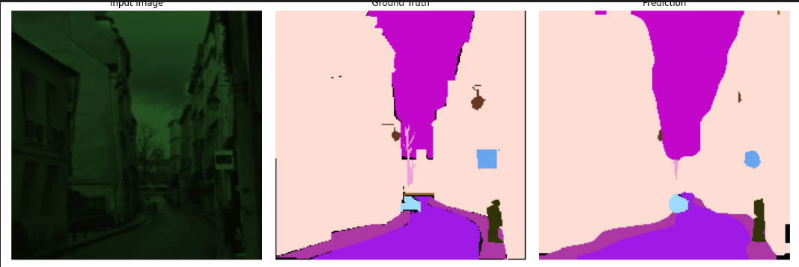
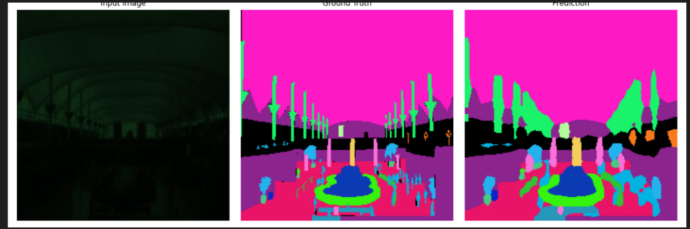

# 🧠 Bachelor Work

This project builds on [DINOv2](https://github.com/facebookresearch/dinov2), with core functionality implemented in the `dinov2` submodule.

Inspired by the **RAW Adapter** paper, this work integrates and modifies three key components:

- **Input-level Adapter**
- **Model-level Adapter**
- **Merge Blocks**

---

## 📁 Added Files

### **Configs**
- `configs/train/custom.yaml`

### **Data**
- `data/datasets/augmentation_rggb.py`
- `data/datasets/knn_for_main.py`
- `data/datasets/main_dataset.py`
- `data/datasets/my_dataset.py`
- `data/datasets/npz_raw.py`
- `data/datasets/pre_process_in_advance.py`
- `data/datasets/pre_processor.py`
- `data/datasets/raise_dataset.py`
- `data/datasets/raw_nod.py`

### **Evaluation**
- `eval/segmentation1.py`
- `eval/segmentation2.py`

### **Models**
- `models/help.py`
- `models/input_level_adapter.py`

### **Training**
- `train/rgb_to_raw.py`
- `train/knn.py`
- `train/segmentation_head.py`

---

## 🛠️ Modified Files

- `configs/eval/vitb14_pretrain.yaml`
- `data/transforms.py`
- `data/augmentations.py`
- `data/loaders.py`
- `eval/linear.py`
- `eval/utils.py`
- `models/vision_transformer.py`
- `train/ssl_meta_arch.py`
- `train/train.py`

---

## 🗂️ Dataset Structure

The project expects RGGB-formatted `.npy` images in the following structure:


```plaintext
dataset/
├── train/
│   └── dataset_name/
│       └── images/
│           └── *.npy
├── val/
│   └── dataset_name/
│       └── images/
│           └── *.npy
└── test/
    └── dataset_name/
        └── images/
            └── *.npy

```


---

## 🧪 Commands

### 🚀 Train Encoder

```bash
python3 -m dinov2.train.train \
  --config-file dinov2/configs/train/custom.yaml \
  --output-dir lala3
```

### Run Linear Classifier
```bash
python3 -m dinov2.eval.linear \
  --config-file dinov2/configs/eval/vitb14_pretrain.yaml \
  --pretrained-weights lala3/model_0010499.rank_0.pth \
  --output-dir lalaa3/
```


### Run segmentation
```bash
CUDA_LAUNCH_BLOCKING=1 python3 -m dinov2.eval.segmentation2 \
  --train-dataset "Seg:root=/path/to/ADE20K/ADEChallengeData2016:split=train" \
  --val-dataset "Seg:root=/path/to/ADE20K/ADEChallengeData2016:split=val" \
  --pretrained-weights basic/model_0008999.rank_0.pth \
  --config-file dinov2/configs/eval/vitb14_pretrain.yaml \
  --output-dir seg_on_basic
```

### Segmentation examples




### Note
for evaluation of encoder(classifier, segmentation) labels needed, so only pictures with labels was used to train these decoders
